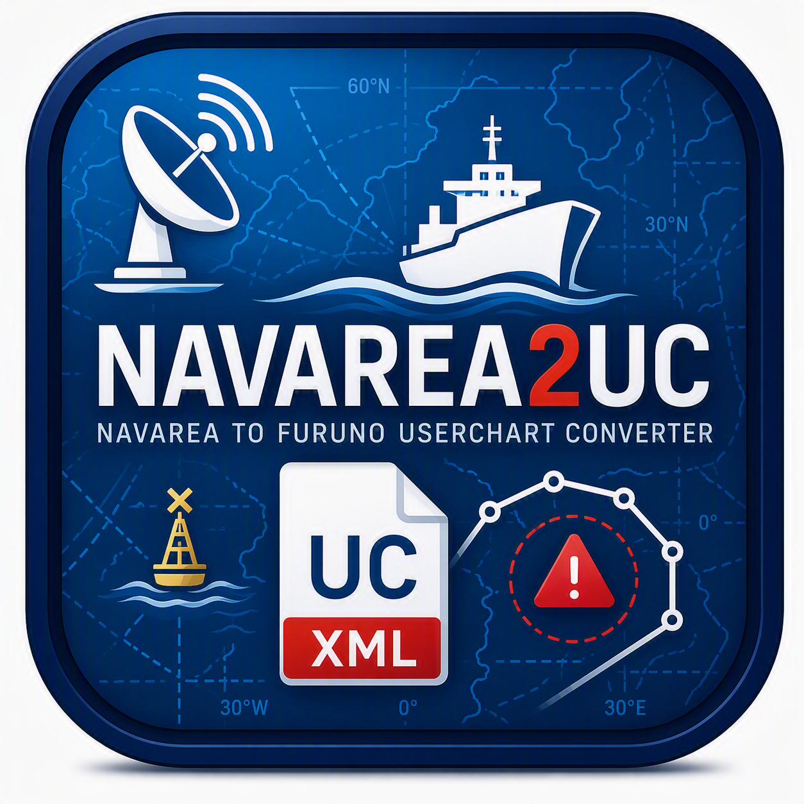

<p align="center">
  
</p>


<h1 align="center">NAVAREA2UC</h1>

<p align="center">

## Project Structure

NAVAREA2UC/

├── .github/

├── NAVAREA2UC_v1.2.0.exe

├── README.md

├── main.py

├── version_info.txt

├── icon.ico

└── input.txt  (example NAVAREA messages)


# NAVAREA2UC


Any Source. Any Format. Any ECDIS.

NAVAREA2UC automatically parses NAVAREA text messages and generates
structured ECDIS-ready UserChart data. The current validated XML export
targets Furuno UserChart systems, with broader ECDIS adapters planned.

Generated objects preserve original NAVAREA references and descriptions whenever possible.

## Project notices

- [License](LICENSE) — proprietary repository terms and reserved rights.
- [Notice](NOTICE.md) — project independence, derived output and usage boundaries.
- [Data sources policy](DATA-SOURCES.md) — NAVAREA notices are read and interpreted as input; they are not distributed by NAVAREA2UC.
- [Third-party notices](THIRD_PARTY_NOTICES.md) — dependency licenses and compliance notes.


## Features

✅ Automatic NAVAREA detection

✅ Multiple input files support

✅ Whole-folder processing

✅ Automatic output split by NAVAREA region

✅ Point object generation

✅ Offshore object extraction (FPSO, FSO, MODU, RIG, PLATFORM)

✅ Trackline detection

✅ Area generation

✅ Circle generation

✅ Danger zone classification

✅ Object descriptions

✅ ECDIS-ready workflow

✅ Supports common NAVAREA coordinate formats

✅ Legacy Furuno object-limit splitter


## Supported Objects

### Points

- FPSO
- FSO
- MODU
- Offshore rigs
- Buoys
- Lights
- Moorings
- Wrecks
- Derelicts
- Reported depths
- Communication facilities

### Lines

- Tracklines
- Routes
- Pipelines
- Cables
- Channels

Line vertex order is treated as source data, not as an Area ring that can be
sorted blindly. For every multi-vertex Line, the parser checks repeated
non-adjacent vertices, non-adjacent segment crossings, suspiciously long legs,
and track connectivity. For one connected track it may select a shortest
non-crossing path, but only after validating that candidate and retaining the
raw coordinates in provenance. Clearly separated tracks are emitted as
separate Lines; ambiguous cases keep the raw Line and add reference points.
No message is rejected merely because ordering is suspicious:
`GEOMETRY_LINE_ORDER_REPAIRED`, `GEOMETRY_LINE_TRACKS_SPLIT`, and
`GEOMETRY_LINE_ORDER_REVIEW` record the decision and evidence for later review.

### Areas

- Area bounded by coordinates
- War Risk Areas
- Mine Danger Areas
- Firing Practice Areas
- Exclusion Zones
- No Anchoring Areas

### Circles

- Warnings defined by a radius from a central position

## Compatibility

Successfully tested on:

- Furuno ECDIS (Software Ver. 2450074-05.27, UserChart v1.3)
- Furuno ECDIS Legacy (Software Ver. 2450074-03.37, UserChart v1.0)

### Legacy Furuno Support

Legacy UserChart exports are automatically split into multiple files
when the chart object count exceeds legacy system limits.
Legacy splitting preserves NAVAREA message integrity.
Objects belonging to the same NAVAREA warning are never split across multiple legacy UserChart files whenever possible.
Legacy Furuno systems may impose limits on the number of UserChart objects.
NAVAREA2UC attempts to automatically partition charts to improve compatibility, but actual limits may vary depending on Furuno software version.


## Usage

1. Create an empty working folder.
2. Copy NAVAREA2UC.exe into the folder.
3. Place one or more NAVAREA text files in the same folder.
4. Run NAVAREA2UC.exe.
5. Import the generated XML files into the target ECDIS UserChart workflow.

The converter automatically detects NAVAREA regions and creates separate output files for each NAVAREA.

### Debug output

Normal runs show the conversion summary and warnings without per-handler diagnostic
noise. Enable detailed handler and partition diagnostics only when investigating a
specific input:

```bash
python main.py --debug input.txt
# or
NAVAREA2UC_DEBUG=1 python main.py input.txt
```

In an interactive console, the progress indicator remains visible for roughly
12 seconds even when a small input finishes immediately. It moves through
reading, analysis, partitioning, geometry building, XML export, and final
validation stages so a fast run does not appear to stop on one message.
Redirected output and automated validation do not receive this artificial
delay.

## Corpus validation

The repeatable corpus runner evaluates the 21 primary global NAVAREA source
files by default. The retained coastal and other regional feeds are kept for
future implementation and can be included explicitly with
`--include-future-coastal`. The source sets are listed in
`corpus_manifests/navarea_primary.txt` and
`corpus_manifests/coastal_future.txt`.

## Official source ingestion (future)

Candidate official NAVAREA/MSI source endpoints are retained in
`corpus_manifests/official_navarea_sources.txt`. They are source inputs for a
future ingestion layer, not pages to copy directly into the product.

Official notices will vary in language, layout, encoding, and message format.
The future website experience must therefore:

- fetch and retain the official source reference for traceability;
- normalize the notice into a consistent NAVAREA2UC data model;
- create a clear, adapted presentation with readable text, structured metadata,
  geometry, validity, and safety classification;
- keep the raw source available as evidence without using it as the final user
  facing message.

The public site should show the adapted, polished notice first: a consistent
NAVAREA2UC message card and detail view rather than an unformatted agency page.

The runner records source references, selected handlers, object counts,
diagnostics, geometry status, and mixed-geometry component losses:

```bash
python corpus_runner.py --output reports/navarea-corpus.json
```

To compare the full retained library, including future coastal sources:

```bash
python corpus_runner.py \
  --include-future-coastal \
  --output reports/navarea-corpus-all-regional.json
```

Use a prior report for a differential pass. Message IDs supplied with
`--expected-id` are allowed to change; all other changes remain visible as
unexpected:

```bash
python corpus_runner.py \
  --baseline reports/before.json \
  --output reports/after.json \
  --expected-id "NAVAREA IX 208/2026"
```

The report separates confirmed geometry, reference-only coordinates,
rejected invalid areas, operation-only results, and unclassified messages.

### Release geometry gate

Run the release gate before publishing. It returns a non-zero status for
processing errors, unexpected differential changes, or an explicit Area, Line,
or Circle statement that has not been reviewed:

```bash
bash scripts/release-validation.sh
```

The report is written to `reports/release-corpus.json`. Existing reviewed
findings remain visible in the report, while new component-loss findings block
the release and include source-line references.

After reviewing a full report, update the compact release baseline without
hand-entering its message count. The command reruns the current corpus and
rejects the update unless the reviewed report has matching message-count and
fingerprint data:

```bash
python corpus_runner.py \
  --root . \
  --update-baseline reports/corpus_baseline.json \
  --source-report reports/corpus_differential_latest.json
```

To inspect the baseline that would be derived before approving a reviewed
report, use the read-only preview mode. It shows the derived message count and
fingerprint, whether the reviewed report still matches the current corpus, and
the review metadata that would be preserved. It does not write the baseline
file; it returns a non-zero status when the reviewed report is stale:

```bash
python corpus_runner.py \
  --root . \
  --preview-baseline reports/corpus_baseline.json \
  --source-report reports/corpus_differential_latest.json
```

For release automation, add `--json` (or the explicit
`--preview-baseline-json` alias) to emit one JSON object instead of the text
preview:

```bash
python corpus_runner.py \
  --root . \
  --preview-baseline reports/corpus_baseline.json \
  --source-report reports/corpus_differential_latest.json \
  --json
```

The structured preview keeps the same exit status: `0` when the reviewed
report matches the current corpus and `1` when it is stale or otherwise does
not match. Errors are written to stderr. The JSON object has these fields:

| Field | Meaning |
| --- | --- |
| `reviewed_report_messages` | Derived message count from the reviewed report. |
| `reviewed_report_sha256` | Derived fingerprint of the reviewed report content. |
| `current_messages` | Message count in the current corpus run. |
| `current_report_sha256` | Fingerprint of the current corpus report. |
| `reviewed_report_matches_current` | Whether the reviewed report matches the current corpus. |
| `review_metadata` | Existing baseline fields preserved by an update, excluding derived baseline fields. |
| `proposed_baseline` | Compact baseline that would be written by `--update-baseline`; no file is written by preview. |

All preview JSON is written to stdout, making it safe for CI to capture and
parse without scraping the human-readable output.

## Export Modes

### Modern Furuno

Creates UserChart XML v1.3 files compatible with modern Furuno ECDIS systems.

Output:

output_NAVAREA_X.xml

### Legacy Furuno

Creates UserChart XML v1.0 files compatible with legacy Furuno ECDIS systems.

Output:

output_NAVAREA_X_legacy.xml

If chart object count exceeds legacy limits, multiple files are generated automatically:

output_NAVAREA_X_legacy_Part1.xml
output_NAVAREA_X_legacy_Part2.xml
...

### ECDIS semantics demo

The reproducible proof fixture
`examples/NAVAREA2UC_ECDIS_SEMANTICS_DEMO.xml` contains a compact scene with
three buoy classes only — yellow special-mark (including channel and other
normal buoys), isolated danger, and degraded — plus a security incident,
iceberg trackline, lighthouse and leading lights, drifting-object danger,
firing-exercise danger zone, offshore infrastructure, route and survey lines,
and an explosives circle.
The fictional scene is placed in open water south of Odesa in the north-western
Black Sea, rather than on a real warning position.
It uses the same modern UserChart v1.3 exporter as production output and is
intended for manual import into an ECDIS for a visual evidence screenshot.

Regenerate it with:

```bash
python examples/generate_ecdis_semantics_demo.py
```

## Notes

NAVAREA messages are not fully standardized.

The parser attempts to recognize common coordinate formats, tracklines, areas, circles and offshore installations automatically.

Some NAVAREA warnings may still require manual verification, especially complex area definitions.

## Disclaimer

Always verify generated chart objects against official navigational warnings and charts.

Use at your own responsibility.

## Why?

Because manually plotting dozens of NAVAREA objects into ECDIS is a headache.

---

Fair winds and following seas.

## Version History

### v1.1.0

- Added legacy Furuno UserChart export
- Improved XML compatibility
- Legacy label style normalization
- Verified on legacy Furuno ECDIS

### v1.2.0

- Added message-aware Legacy UserChart splitter
- Preserved NAVAREA message integrity during legacy export
- Added automatic generation of multi-part legacy UserCharts
- Legacy descriptions limited to 999 characters
- Improved area parsing
- Improved multi-area warning detection
- Improved circle detection
- Improved multi-point warning handling
- Expanded offshore object recognition
- Improved complex offshore installation parsing
- Improved compatibility with legacy Furuno ECDIS

### v1.2.1

- Improoved NAVAREA parsing and coordinate extraction
- Improoved Area, route, channel and point generation
- Improved RIGLIST / MODU 
- Improved coordinate parsing
- Improved geometry isolation
- Added handler diagnostics
- Added Mixed geometry support
- AddedMulti-area package support
